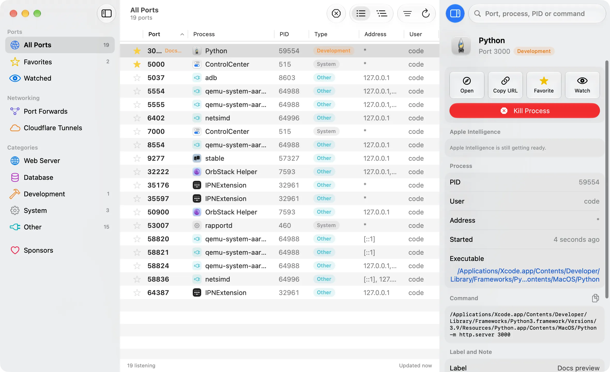

# PortKiller

<p align="center">
  
</p>

<p align="center">
  <a href="LICENSE"></a>
  <a href="https://www.apple.com/macos/"></a>
  <a href="https://www.microsoft.com/windows"></a>
  <a href="https://github.com/productdevbook/port-killer/releases"></a>
</p>

<p align="center">
A powerful cross-platform port management tool for developers.<br>
Monitor ports, manage Kubernetes port forwards, integrate Cloudflare Tunnels, and kill processes with one click.
</p>

### macOS

<p align="center">
  
</p>

### Windows

<p align="center">
  
</p>

## Installation

### macOS

**Homebrew:**
```bash
brew install --cask productdevbook/tap/portkiller
```

**Manual:** Download `.dmg` from [GitHub Releases](https://github.com/productdevbook/port-killer/releases).

PortKiller 4 requires macOS 27 on Apple silicon. On earlier macOS versions, use [PortKiller 3.3.3](https://github.com/productdevbook/port-killer/releases/tag/v3.3.3).

### Windows

Download `.zip` from [GitHub Releases](https://github.com/productdevbook/port-killer/releases) and extract.

## Features

### Port Management
- 🔍 Auto-discovers all listening TCP ports (native `libproc` scanning on macOS, no `lsof`)
- ⚡ One-click process termination: graceful, force, process tree, or with its open connections
- 🔄 Auto-refresh with configurable interval
- 🔎 Search and filter by port, process, PID, command or label
- ⭐ Favorites, labels and notes for important ports
- 👁️ Watched ports with notifications you can kill from
- 📂 Smart categorization (Web Server, Database, Development, System)
- ✨ Apple Intelligence explains unfamiliar processes, on device (macOS)

### Kubernetes Port Forwarding
- 🔗 Create and manage kubectl port-forward sessions
- 🔌 Auto-reconnect on connection loss
- 📝 Connection logs and status monitoring
- 🔔 Notifications on connect/disconnect

### Cloudflare Tunnels
- ☁️ View and manage active Cloudflare Tunnel connections
- 🌐 Quick access to tunnel status

### Plugins (macOS)
- 🧩 Add tabs and port actions with plugins written in any language, see [PLUGINS.md](platforms/macos/PLUGINS.md)

### Cross-Platform
- 📍 Menu bar integration (macOS)
- 🖥️ System tray app (Windows)
- 🎨 Native UI for each platform

## Contributing

See [CONTRIBUTING.md](CONTRIBUTING.md) for development setup.

## Sponsors

<p align="center">
  <a href="https://cdn.jsdelivr.net/gh/productdevbook/static/sponsors.svg">
    
  </a>
</p>

## License

MIT License - see [LICENSE](LICENSE).
